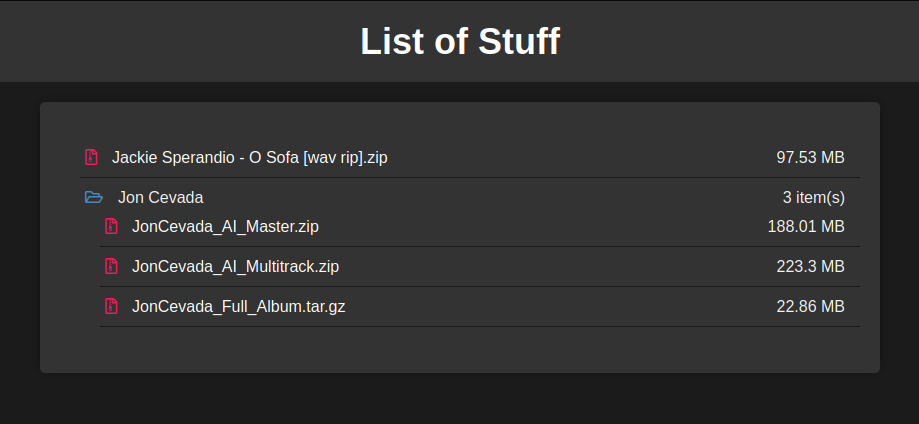

# Single File PHP File Browser

## Table of Contents
1. [Introduction](#introduction)
2. [Functionality](#functionality)
3. [Screenshot](#screenshot)
4. [Usage](#usage)
5. [Technologies Used](#technologies-used)
6. [Best Practices](#best-practices)
7. [Code Explanation](#code-explanation)
8. [Roadmap](#roadmap)

## Introduction

The **Single File PHP File Browser** is a lightweight and straightforward project that provides a web-based directory listing for the files contained within a specified directory. This project serves as a quick and easy way to share files or documents with others via a web interface. This code provides a flexible way to display and customize directory listings, making it useful for creating file browsers and similar applications.

[Back to top](#table-of-contents)

## Functionality

The project offers the following functionalities:

- Lists files and folders contained within a specified directory.
- Allows users to navigate through the directory structure.
- Differentiates between files and folders.
- Excludes specific file extensions, such as HTML, PHP, SWP, and CSS, from the listing.

[Back to top](#table-of-contents)

## Screenshot

<p align="center">
    
</p>

[Back to top](#table-of-contents)

## Usage

To use the Single File PHP File Browser, follow these simple steps:

1. Download the `index.php` file from this project.

2. Place the `index.php` file in the folder you want to share on the web.

3. Access the folder using a web browser. You can do this by entering the folder's URL in your web browser's address bar. For example, if you placed `index.php` in a folder called "MyFiles" on your web server, you would access it like this: `http://yourdomain.com/MyFiles/`.

The `index.php` file will automatically generate a directory listing for the specified folder, allowing you to view and access the contained files and folders via a user-friendly web interface.

[Back to top](#table-of-contents)

## Technologies Used

- **PHP**: PHP is used to generate the directory listing and handle file system operations.
- **HTML/CSS**: HTML and CSS are used for the presentation and styling of the directory listing.
- **Font Awesome**: Font Awesome icons are used to enhance the visual representation of files and folders.

[Back to top](#table-of-contents)

## Best Practices

To maintain simplicity and effectiveness, this project follows some best practices:

- **Minimalism**: The code is kept minimal and straightforward to ensure ease of understanding and maintenance.
- **Security**: Security measures are taken by excluding certain file extensions to prevent exposing sensitive files (e.g., PHP files).
- **User Experience**: The interface is designed for user-friendliness, with clear differentiations between files and folders.

[Back to top](#table-of-contents)

## Code Explanation

This PHP code snippet is designed to generate a directory listing for a specified directory, presenting its contents in a structured HTML format. The code can be used to showcase files and subdirectories while allowing for customization of icons based on file extensions. Below is a breakdown of how the code works:

### Function `listDirectory`

```php
function listDirectory($directory) {
    // ...
}
```

- `listDirectory` is a recursive function that takes the path to a directory as its parameter.

### Scanning Directory Contents

```php
$files = scandir($directory);
```

- `scandir` is used to retrieve an array of files and directories within the specified `$directory`.

### Excluded File Extensions

```php
$notAllowedExtensions = array('html', 'php', 'swp', 'css');
```

- An array, `$notAllowedExtensions`, is defined to store file extensions that should be excluded from the listing. These extensions won't be displayed in the directory listing.

### File Extension to Icon Mapping

```php
$iconMapping = array(
    'pdf' => 'icon-pdf',
    'doc' => 'icon-doc',
    'txt' => 'icon-txt',
    'zip' => 'icon-zip',
    'md' => 'icon-md',
    'tar' => 'icon-tar',
    'gz' => 'icon-gz',
    'sh' => 'icon-sh',
    // Add more mappings as needed
);
```

- `$iconMapping` is an associative array that maps file extensions to corresponding CSS icon classes. These classes determine the icons displayed next to file names in the directory listing.

### Generating the Directory Listing

```php
echo '<ul class="folder-contents">';
foreach ($files as $file) {
    // ...
}
echo '</ul>';
```

- An unordered list (`<ul>`) with the class "folder-contents" is initiated to structure the directory listing.

### Iterating Through Files and Subdirectories

```php
foreach ($files as $file) {
    // ...
}
```

- A `foreach` loop iterates through the files and directories obtained from `$files`.

### Handling Subdirectories Recursively

```php
if (is_dir($path)) {
    // ...
}
```

- If the current item in the loop is a directory, it is displayed as a folder in the listing. The function `listDirectory` is then called recursively to list the contents of the subdirectory.

### Customizing Icons and File Links

```php
$iconClass = isset($iconMapping[$extension]) ? $iconMapping[$extension] : 'icon-default';
echo '<li><i class="' . $iconClass . '"></i><a href="' . $file . '">' . $file . '</a></li>';
```

- Icons are customized based on file extensions using the `$iconMapping` array. If an extension is not found in the mapping, it defaults to 'icon-default'.
- Hyperlinks are generated for each file or directory entry.

### Specifying the Directory

```php
$directory = './'; // Specify the directory you want to list
```

- The `$directory` variable is set to the path of the directory you want to list.

### Invoking the Function

```php
listDirectory($directory);
```

- Finally, the `listDirectory` function is called with the specified directory to generate the directory listing.

[Back to top](#table-of-contents)

## Roadmap

Here are some planned enhancements for the Single File PHP File Browser:

- **Mouse-over File Preview:** Implement mouse-over file preview to display a small preview when hovering over file links.
- **Bulk Downloads:** Add the ability to select and download multiple files at once.
- **Pagination:** Implement pagination for directories with a large number of files and folders.
- **Lazy Loading:** Improve performance by implementing lazy loading for large directories.

Feel free to contribute to the project and help make these enhancements a reality.

[Back to top](#table-of-contents)
